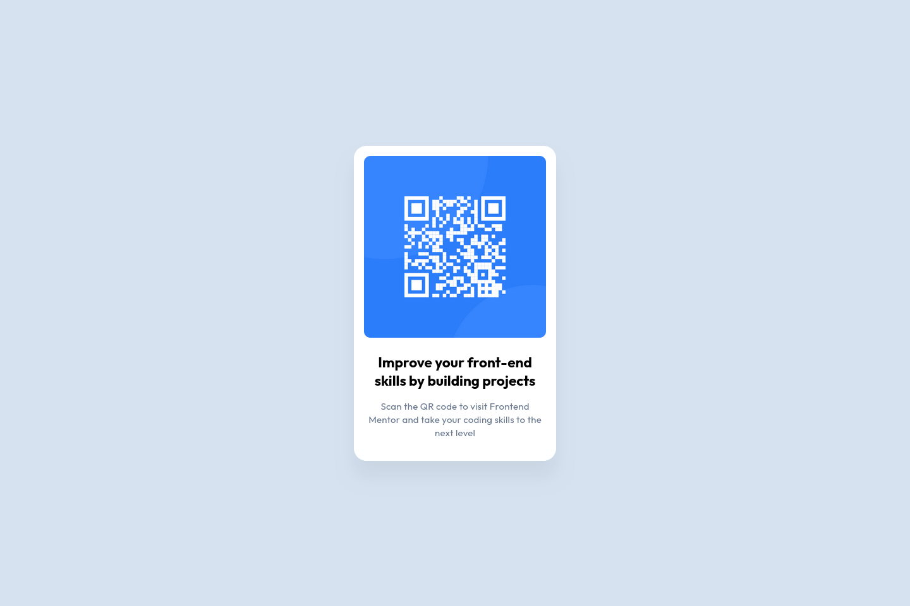

# QR Code Component

This is a solution for the [QR Code component](https://www.frontendmentor.io/challenges/qr-code-component-iux_sIO_H) challenge from Frontend Mentor.

- **Solution URL:** [https://github.com/angelo-sigo/frontend-mentor/tree/main/qr-code-component](https://github.com/angelo-sigo/frontend-mentor/qr-code-component)

## Table of contents

- [Overview](#overview)
- [My process](#my-process)
  - [Built with](#built-with)
  - [What I learned](#what-I-leanerd)
  - [Continuous development](#continuous-development)
- [Author](#author)

## My process

### Built with

- HTML5
  - Semantic tags
  - Google Fonts CDN
  - BEM CSS
- CSS3
  - Flexbox design
  - CSS variables

### What I learned

In this project I didn't put into practice any concepts that were particularly new to me. However, I was able to take the opportunity to recall old knowledge, such as semantic HTML and responsive design with flexbox.

### Continuous development

In the near future, I plan to implement component modularization in this project using `React.js` with `Node.js` and CSS preprocessors such as `SASS`.

## Author

- Frontend Mentor - [@angelo-sigo](https://www.frontendmentor.io/profile/angelo-sigo)
- LinkedIn - [Angelo Silva](https://www.linkedin.com/in/angelo-sigo/)
- WhatsApp - [+55 (61) 98195-9841](https://wa.me/5561981959841)