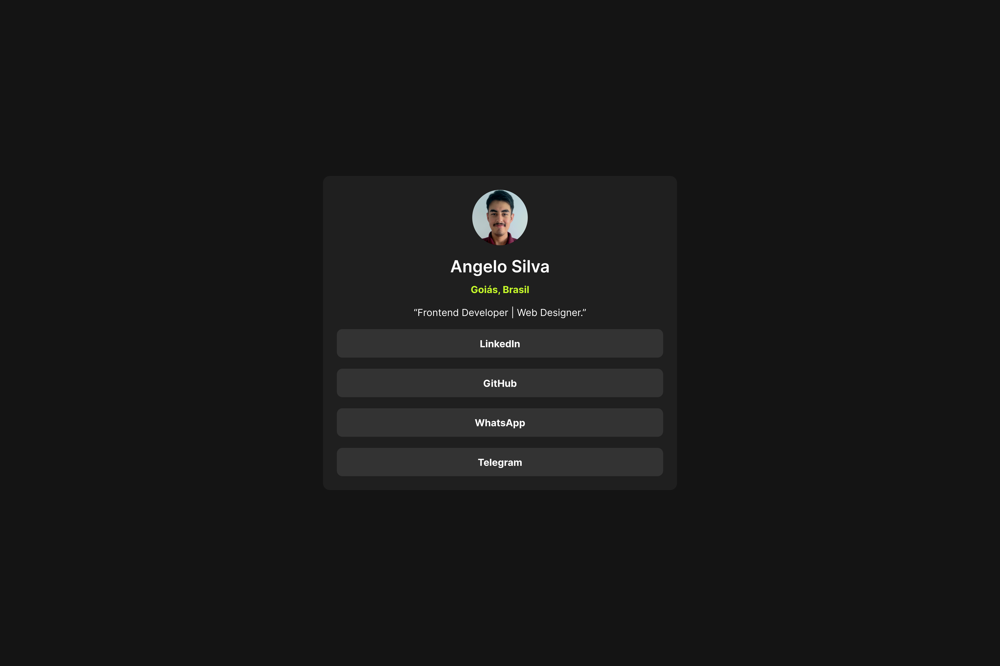

# Links de Redes Sociais

Esta é uma solução para o desafio de [links de redes sociais](https://www.frontendmentor.io/challenges/social-links-profile-UG32l9m6dQ) do Frontend Mentor.

- **URL da solução:** [github.com/angelo-sigo/frontend-mentor/tree/main/social-links-profile](https://github.com/angelo-sigo/frontend-mentor/tree/main/social-links-profile)
- **Projeto funcionando:** [angelo-sigo.github.io/frontend-mentor/social-links-profile](https://angelo-sigo.github.io/frontend-mentor/social-links-profile)

## Table of contents
- [Meu processo](#meu-processo)
  - [Feito com](#feito-com)
  - [O que aprendi](#o-que-aprendi)
  - [Desenvolvimento constante](#desenvolvimento-constante)
- [Autor](#autor)

## Meu processo

### Feito com

- HTML5
  - Tags semânticas
- CSS3
  - Flexbox layout
  - Variáveis
  - Animações

### O que aprendi

Olá pessoal, tudo bem com vocês? Neste desafio tentei aplicar ao máximo o conceito de Produto Mínimo Viável (PMV) e a técnica de projetar primeiro para dispositivos móveis (Primeiro Mobile). Me orgulho do resultado final, para uma primeira solução com as funcionalidades mínimas, e espero continuar evoluindo o código.

### Desenvolvimento constante

Para continuar o desenvolvimento pretendo adicionar a navegação dos links através do teclado, além de refatorar o código CSS para melhorar a legibilidade.

## Autor

- **WhatsApp:** [+55 61 98195-9841](https://wa.me/5561981959841)
- **Telegram:** [@angelo_sigo](https://t.me/angelo_sigo)
- **E-mail:** [angelosilva.goncalves@outlook.com.br](mailto:angelosilva.goncalves@outlook.com.br)
