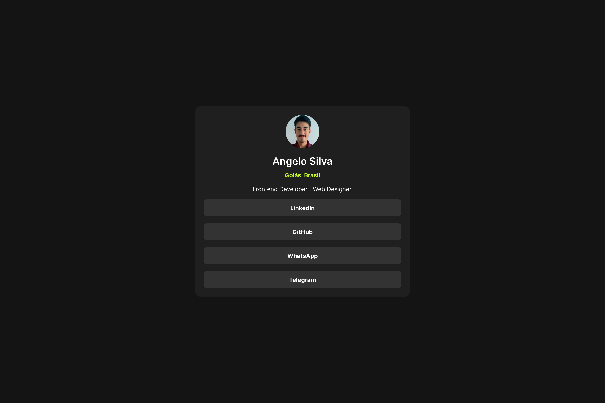

# Social Links Profile

This is a solution to the [social links profile](https://www.frontendmentor.io/challenges/social-links-profile-UG32l9m6dQ) challenge on Frontend Mentor.

- **Solution URL:** [github.com/angelo-sigo/frontend-mentor/tree/main/social-links-profile](https://github.com/angelo-sigo/frontend-mentor/tree/main/social-links-profile)
- **Live site:** [angelo-sigo.github.io/frontend-mentor/social-links-profile](https://angelo-sigo.github.io/frontend-mentor/social-links-profile)

## Table of contents
- [My process](#my-process)
  - [Built with](#built-with)
  - [What I learned](#what-i-learned)
  - [Continuous development](#continuous-development)
- [Author](#author)

## My process

### Built with

- HTML5
  - Semantic tags
- CSS3
  - Flexbox layout
  - Variables
  - Animations

### What I learned

Hi everyone, how's it going? In this challenge, I tried to apply the concept of Minimum Viable Product (MVP) as much as possible and the technique of designing for mobile devices first (Mobile-First). I'm proud of the final result for a first solution with the minimum features, and I hope to keep improving the code.

### Continuous development

To continue the development, I plan to add keyboard navigation for the links, as well as refactor the CSS code to improve readability.

## Author

- **WhatsApp:** [+55 61 98195-9841](https://wa.me/5561981959841)
- **Telegram:** [@angelo_sigo](https://t.me/angelo_sigo)
- **E-mail:** [angelosilva.goncalves@outlook.com.br](mailto:angelosilva.goncalves@outlook.com.br)
